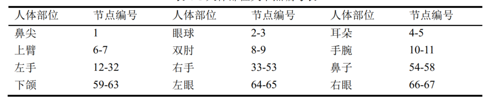
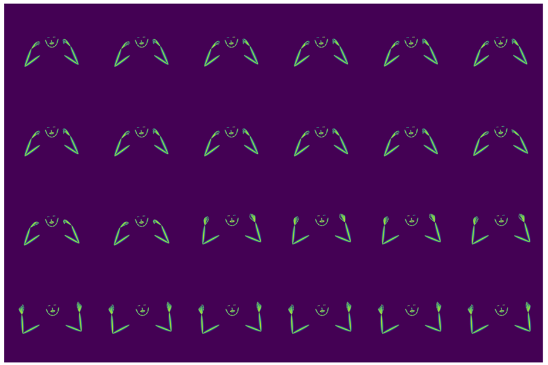
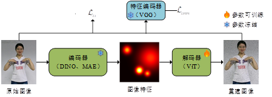
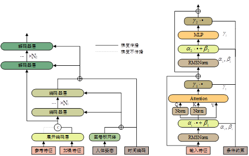
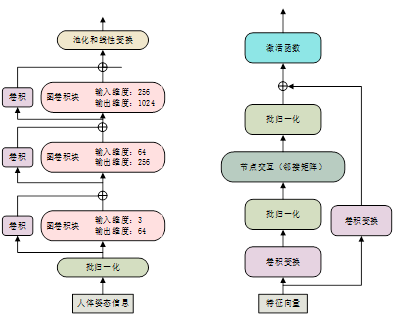

# Pose_Guidance_ISLP
Only using a RTX 4090 for sign language production

<div align="center">
<h1>Pose_Guidance_ISLP </h1>
<h3>We utilize human body keypoints and reference subject images as control conditions to generate sign language images matching target motions, then synthesize the final sign language video from multiple generated frames. Notably, this project adopts LoRA fine-tuning, enabling training of large feature encoders (the large-scale ViT and a 30-layer DDT with a channel width of 1152) on a single NVIDIA RTX 4090 GPU.</h3>

</div>


## Method
**First, we employ HRNet coupled with the DARK detector pre-trained on the COCO-WholeBody dataset to detect human keypoints from sign language videos, and retain a total of 67 keypoints covering the face, upper arms and hands.**
<p align="center">
  
</p>
<p align="center">
  
</p>

**The overall pipeline leverages latent space diffusion with velocity-prediction-based diffusion computation; the image encoder and decoder are trained exclusively on sign language datasets.**
<p align="center">
  
</p>

**This work takes DDT as the base diffusion model. Since generating sign language images requires two conditional inputs: human body keypoint sequences (to regulate the signer’s movements in generated frames) and reference identity images (to control the subject’s appearance), we revise the conditional control mechanism of DDT: features extracted from reference identity images are concatenated with noisy latent variables to achieve feature interaction during attention computation. For human body keypoint data, we extract features via a three-layer stacked graph convolutional network, followed by normalization for conditional modulation.**
<p align="center">
  
</p>
<p align="center">
  
</p>

## Getting Started

We recommend using the pytorch>=2.3, cuda>=11.8, transformers.

### Model Training and Inference

**Train:**
```bash
# stage1
python re_flow/train_RAE.py
# stage2
python re_flow/train.py
```

**Inference:**
```bash
python re_flow/sample.py
```

## Acknowledgment

This project is built upon the following open-source works:

- **RAE**：  Diffusion Transformers With Representation Autoencoders([paper](https://arxiv.org/abs/2510.11690), Code available at [code](https://github.com/bytetriper/RAE)), We used the model architecture and training pipeline from this repository.

We thank the authors for their contributions and open-sourcing these valuable tools.

